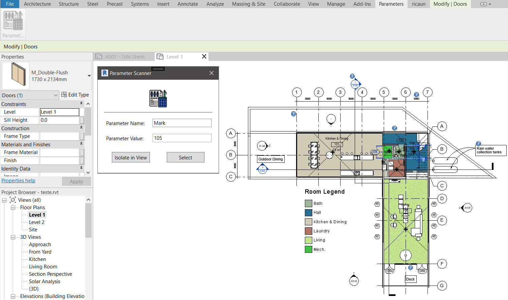
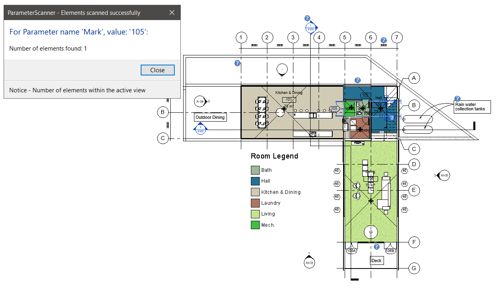

# Parameter Scanner Add-in for Revit

## Project Description

The Parameter Scanner add-in for Revit is designed to enhance the model review process by allowing users to scan model elements for specific parameter values. This tool provides the functionality to isolate or select elements based on their parameters.

## Features

- **Ribbon Tab**: The add-in introduces a new Ribbon tab named "Parameters".
- **Parameter Scanner Button**: Within the Parameters tab, a button labeled "Parameter Scanner" opens a form.
- **Search Form**: The form allows users to specify a parameter name and value to search within the model elements. It also supports searching for elements with empty parameter values if the parameter value field is left blank.
- **UI/UX**: The form is designed to be intuitive, featuring interaction buttons to either isolate or select the identified elements.

## Setup Instructions

### Installation

1. **Clone the Repository**: Clone the project repository to your local machine.
    ```bash
    git clone https://github.com/viniciusmtsantos/cs-parameter_scanner.git
    ```
2. **Open in Visual Studio**: Open the project solution file (`ParameterScanner.sln`) in Visual Studio 2019 or 2022.

3. **Place files**: If you want to run a debug, I have created a post-build event that automatically copies the necessary files to the Revit Add-ins folder. The post-build event is as follows. However, you can to place the files manually, if you prefer.

    ```xml
    <PostBuildEvent>
        if exist "$(AppData)\Autodesk\REVIT\Addins\20xx" copy "$(ProjectDir)*.addin" "$(AppData)\Autodesk\REVIT\Addins\20xx"
        if exist "$(AppData)\Autodesk\REVIT\Addins\20xx" copy "$(ProjectDir)$(OutputPath)*.dll" "$(AppData)\Autodesk\REVIT\Addins\20xx"
        if exist "$(AppData)\Autodesk\REVIT\Addins\20xx" copy "$(ProjectDir)$(OutputPath)Resources\*.ico" "$(AppData)\Autodesk\REVIT\Addins\20xx"
    </PostBuildEvent>
    ```

### Usage

1. **Access the Add-in**: Navigate to the newly added "Parameters" tab in the Ribbon.

2. **Open Parameter Scanner**: Click the "Parameter Scanner" button to open the search form.

3. **Specify Search Parameters**: Enter the parameter name and value to search for. Leave the value field blank to search for elements with empty parameter values.



4. **Perform Actions**: Use the buttons in the form to isolate or select the identified elements.



## License

This project is licensed under the MIT License. See the LICENSE file for details.

## Contact

For any questions or support, please contact me at [viniciusmtsantos@gmail.com].
